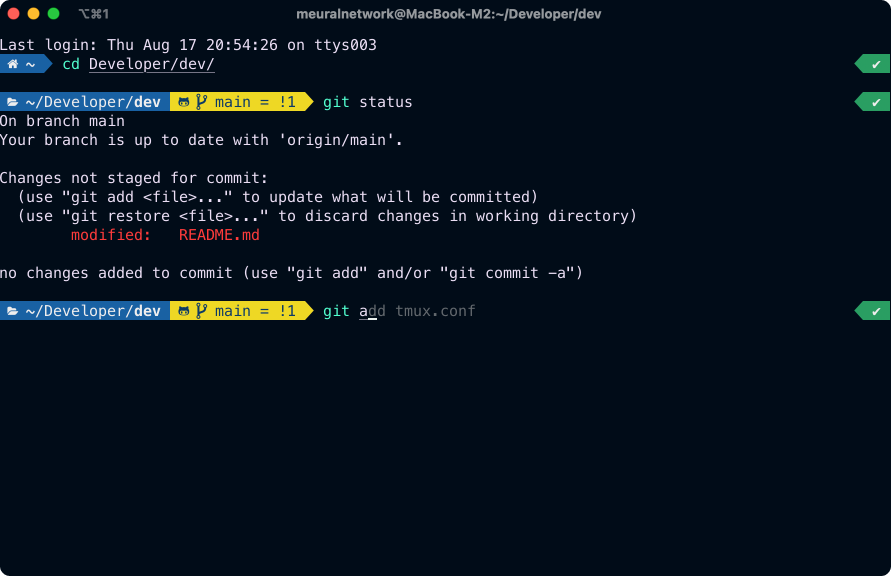

# Zero to IDE

## Prerequisites
1. **Terminal Emulator** : Make sure you have a terminal emulator that supports custom themes. Some popular options include iTerm2 for macOS, Windows Terminal for Windows, and Alacritty for Linux.

2. **Zsh** : Install Zsh if you haven't already. You can usually install it using your system's package manager.

Check the  steps below on how to install Zsh for your OS

<details>

<summary>
<b> MacOS </b>
</summary>

You can use [Homebrew](https://brew.sh) to install **zsh** in MacOS by running

```
brew install zsh
```

After Zsh is installed, you can set it as your default shell by running 

```
chsh -s /usr/local/bin/zsh
```

Close and reopen your Terminal to start using Zsh as your default shell

</details>


<details>

<summary>
<b> Ubuntu </b>
</summary>

Open a terminal on your Ubuntu machine and run the following command to install Zsh using the package manager

```
sudo apt install zsh
```

After Zsh is installed, you can set it as your default shell by running 

```
chsh -s $(which zsh)
```

Close and reopen your Terminal to start using Zsh as your default shell

</details>

<br>

After you install the Zsh, make sure you change the terminal font to a [Nerd Font](https://www.nerdfonts.com) <br>
I personally use **MesloLGS NF** as the icon size in this fonts is correct

### Install Oh My Zsh
Oh My Zsh is a framework for managing Zsh configurations. It provides a set of useful plugins and themes. 

Open your terminal and run the following command to install Oh My Zsh

```
sh -c "$(curl -fsSL https://raw.github.com/ohmyzsh/ohmyzsh/master/tools/install.sh)"
```

### Install Powerlevel10k
Powerlevel10k is not included in Oh My Zsh by default, but you can easily install it as a custom theme

Open your terminal and clone the Powerlevel10k repository into your **~/.oh-my-zsh/custom/themes** directory

```
git clone --depth=1 https://github.com/romkatv/powerlevel10k.git ~/.oh-my-zsh/custom/themes/powerlevel10k
```

Now that it’s installed, open the ”~/.zshrc” file with your preferred editor and change the value of “ZSH_THEME” as shown below

```
ZSH_THEME="powerlevel10k/powerlevel10k"
```

You can install the [plugins](https://github.com/ohmyzsh/ohmyzsh/wiki/Plugins) to add more functionality to your Oh My Zsh. I'd personally recommend [zsh-autosuggestions](https://github.com/zsh-users/zsh-autosuggestions/blob/master/INSTALL.md) and [zsh-syntax-highlighting](https://github.com/zsh-users/zsh-syntax-highlighting/blob/master/INSTALL.md) 


If you followed the steps correctly, your terminal should look something like this



## Tmux
**Tmux** revolutionizes workflow by transforming the terminal into a powerful multitasking environment. It enables users to split, organize, and manage multiple terminal sessions within a single window. Combining **Tmux** with Neovim elevates productivity to the next level, offering seamless multitasking between code editing and terminal operations, creating a dynamic duo that empowers developers to achieve more with efficiency and control.

### Install Tmux

<details>
<summary> <b> MacOS </b> </summary>

You can use [Homebrew](https://brew.sh) to install **tmux** in MacOS by running 

```
brew install tmux
```
</details>


<details>
<summary> <b> Ubuntu </b> </summary>

Open a terminal on your Ubuntu machine and run the following command to install tmux using the package manager

```
sudo apt install tmux
```
</details>


## Neovim
Now that we have *tmux** up and running, let's take our productivity to the next level by integrating **Neovim** into this setup. Neovim is a modern, extensible text editor that's highly configurable and optimized for developers.

### Install Neovim

Regardless of your operating system, you can install Neovim using your package manager

<details>
<summary> <b> MacOS </b> </summary>

On MacOS, use Homebrew. Open your terminal and run

```
brew install tmux
```
</details>


<details>
<summary> <b> Ubuntu </b> </summary>

On your Ubuntu machine. Open your terminal and run

```
sudo apt install tmux
```
</details>

<br>

By now, you should have **Oh My Zsh**, **Tmux** and **Neovim** installed correctly


